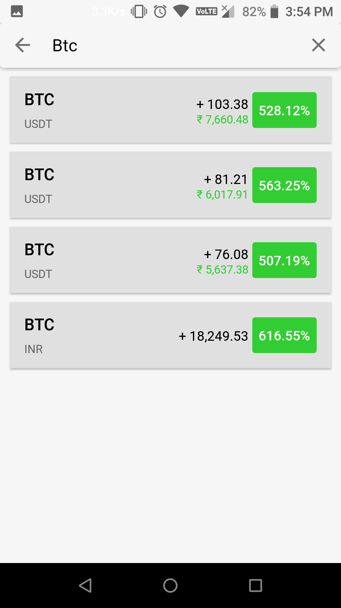

<h1 align="center">CryptoPortfolio</h1>

<b>Mobile application to track cryptocurrency investments.
</b>

 

## Screenshots

  
  

 

  
  

 

  
  

 

  
  

 

  
  

 

  
  

 

  
  

 

### Export Data as JSON

  
  
  

